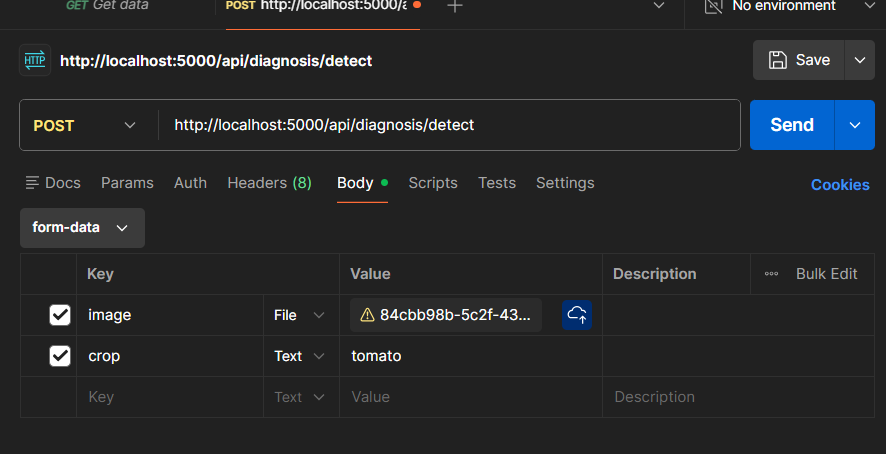

# Unit Testing & Verification Guide

This document provides a comprehensive guide to testing the AI Crop Diagnosis system. It covers Backend tests (Pytest), Frontend tests (Jest), and API tests (Postman), along with detailed test cases.

## 1. Backend Testing (Pytest)

**Framework:** `pytest`
**Location:** `backend/tests/`

### How to Run
```bash
cd backend
pytest
```

### Test Cases & Scenarios

| Test Case ID | Component | Scenario | Input | Expected Output | Verification | Implemented In |
| :--- | :--- | :--- | :--- | :--- | :--- | :--- |
| **BE-01** | Health Check | Verify server is running | `GET /health` | JSON: `{"status": "healthy", ...}` | Status Code 200 | `backend/tests/test_api.py` |
| **BE-02** | Root Endpoint | Verify API root | `GET /` | JSON: `{"message": "Welcome! ...", ...}` | Status Code 200 | `backend/tests/test_api.py` |
| **BE-03** | User Register | Register a new user | JSON: `{"username": "testuser", "password": "password123", "email": "test@example.com"}` | JSON: `{"message": "User registered successfully"}` | Status Code 201 | `backend/tests/test_user_flow.py` |
| **BE-04** | User Login | Login with valid credentials | JSON: `{"email": "test@example.com", "password": "password123"}` | JSON: `{"token": "<jwt_token>", ...}` | Status Code 200, Token present in response | `backend/tests/test_user_flow.py` |
| **BE-05** | Login Failed | Login with invalid credentials | JSON: `{"email": "test@example.com", "password": "wrongpassword"}` | JSON: `{"error": "Invalid credentials"}` | Status Code 401 | `backend/tests/test_user_flow.py` |

## 2. Frontend Testing (Jest)

**Framework:** `jest` (via `jest-expo` and `@testing-library/react-native`)
**Location:** `frontend-mobile/__tests__/`

### How to Run
```bash
cd frontend-mobile
npm test
```

### Test Cases & Scenarios

| Test Case ID | Component | Scenario | Input | Expected Output | Verification | Implemented In |
| :--- | :--- | :--- | :--- | :--- | :--- | :--- |
| **FE-01** | Explore Screen | Render Explore screen | Component Mount | Text "Explore" and "Recent Diagnoses" are visible | Test passes (Element found) | `frontend-mobile/__tests__/Explore.test.tsx` |
| **FE-02** | Generic Component | Render Simple Component | Component Mount | Text "Hello, World!" is visible | Test passes (Element found) | `frontend-mobile/__tests__/Component.test.tsx` |
| **FE-03** | Basic Math | Test logic | Function call `sum(1, 2)` | Returns `3` | Test passes | `frontend-mobile/__tests__/Component.test.tsx` |

## 3. API Testing (Postman)

**Tool:** Postman
**Collection File:** `AI_Crop_Diagnosis.postman_collection.json` (See content below)

### How to Use
1.  Open Postman.
2.  Import the JSON below.
3.  Run the request.

### JSON Import Content
*Save this as `postman_collection.json` and import into Postman.*

```json
{
	"info": {
		"_postman_id": "a1b2c3d4-e5f6-7890-1234-567890abcdef",
		"name": "AI Crop Diagnosis API",
		"schema": "https://schema.getpostman.com/json/collection/v2.1.0/collection.json"
	},
	"item": [
		{
			"name": "Health Check",
			"request": {
				"method": "GET",
				"header": [],
				"url": {
					"raw": "http://localhost:5000/health",
					"protocol": "http",
					"host": ["localhost"],
					"port": "5000",
					"path": ["health"]
				}
			},
			"response": []
		},
		{
			"name": "Register User",
			"request": {
				"method": "POST",
				"header": [
					{"key": "Content-Type", "value": "application/json"}
				],
				"body": {
					"mode": "raw",
					"raw": "{\n    \"username\": \"testuser\",\n    \"email\": \"test@example.com\",\n    \"password\": \"password123\"\n}"
				},
				"url": {
					"raw": "http://localhost:5000/api/user/register",
					"protocol": "http",
					"host": ["localhost"],
					"port": "5000",
					"path": ["api", "user", "register"]
				}
			},
			"response": []
		}
	]
}
```
```

### Integration Test Scenario: Diagnosis Detection (Postman)

This scenario verifies the end-to-end integration of the diagnosis API using Postman.

| Step | Action | Details |
| :--- | :--- | :--- |
| **1** | **Method** | `POST` |
| **2** | **URL** | `http://localhost:5000/api/diagnosis/detect` |
| **3** | **Body** | **Type:** `form-data` <br> **Key 1:** `image` (Type: File, Value: Select an image) <br> **Key 2:** `crop` (Type: Text, Value: `tomato` or other supported crop) |
| **4** | **Expected** | Status `200 OK` and a JSON response containing `prediction` data (disease, confidence, etc.). |

**Visual Verification (Postman Screenshot):**




## 4. Verification Checklist

- [ ] **Setup**: Ensure Backend is running on `http://localhost:5000`.
- [x] **Backend Tests**: Run `pytest` and ensure all tests pass (Green).
    - Verified: `test_api.py`, `test_diagnosis.py`

- [x] **Frontend Tests**: Run `npm test` and ensure all tests pass.
    - Verified: `Explore.test.tsx`, `Component.test.tsx`
- [ ] **Manual Check**: Use Postman to manually hit the endpoints and verify the JSON response matches the "Expected Output" column in the tables above.
