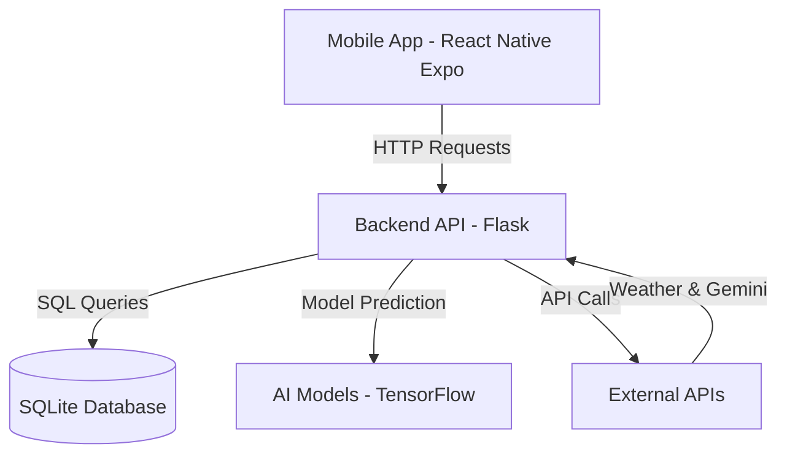

# Developer Documentation (DevDocs)

## 1. Project Overview

The **AI Crop Diagnosis System** is a comprehensive solution designed to help farmers detect crop diseases using deep learning. It consists of a mobile application for end-users and a backend server that handles image processing, disease prediction, and data management.

**Key Features:**
*   **Disease Detection:** Uses TensorFlow/Keras models to identify diseases in crops (Grape, Maize, Potato, Rice, Tomato).
*   **Multilingual Support:** English, Hindi, Telugu, Tamil, Kannada, Marathi.
*   **Treatment Recommendations:** Provides chemical and organic treatment options.
*   **Chatbot:** AI-powered assistant (Gemini) for farming queries.
*   **Offline First:** Critical features work without internet.

---


## 2. Setup Guide

### Prerequisites
- Python 3.8+
- Node.js 18+
- Expo Go app

### Backend Setup
```bash
cd backend
python -m venv venv
venv\Scripts\activate
pip install -r requirements.txt
```

Create `.env` file:
```
GOOGLE_GEMINI_API_KEY=your_key
WEATHER_API_KEY=your_key
SECRET_KEY=dev_secret
PORT=5000
DEBUG=True
```

Run backend:
```bash
cd ../database/seed
python seed_database.py
cd ../../backend
python app.py
```

Server:
```
http://localhost:5000
```

### Frontend Setup
```bash
cd frontend-mobile
npm install
npx expo start
```

---

## 3. Architecture / Design

### System Architecture



### Modules

**Frontend**
- app/
- components/
- services/
- context/

**Backend**
- app.py
- routes/
- ml/
- database/

---

## 4. API Documentation

Base URL:
```
http://localhost:5000/api
```

### User APIs
- POST /user/register  
- POST /user/login  
- GET /user/profile  

### Diagnosis APIs
- POST /diagnosis/detect  
- GET /diagnosis/history  

### Chatbot
- POST /chatbot/message  

---

## 5. Database

Tables:
- users
- diseases
- diagnosis_history
- pesticides
- chat_logs

---

## 6. Coding Standards

### Backend
- PEP8
- snake_case
- modular structure

### Frontend
- TypeScript
- PascalCase components
- camelCase variables

---

## 7. Deployment

### Backend
```bash
pip install waitress
waitress-serve --port=5000 app:app
```

### Frontend
```bash
npm install -g eas-cli
eas build --platform android
```

---

## 8. Troubleshooting

**Network error**
- Use same WiFi
- Replace localhost with IP

**Database error**
- Delete db
- Run seed script

**Module error**
```bash
npm install
npx expo start -c
```